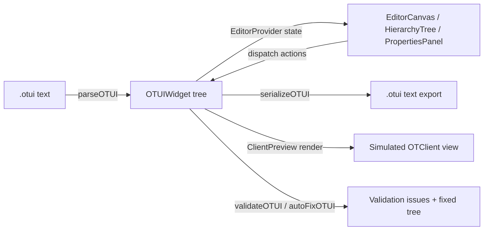

# Architecture

## Overview

The app is a single-page React + TypeScript + Vite application. There is no backend — everything (parsing, validation, rendering, preview) runs client-side in the browser. It uses:

- **React 18** with function components and hooks
- **React Context + `useReducer`** for editor state (no Redux/Zustand)
- **shadcn/ui + Radix UI + Tailwind CSS** for UI primitives
- **Vitest** for unit tests



## Data model — `OTUIWidget`

Defined in [src/lib/otui-types.ts](../src/lib/otui-types.ts):

```ts
interface OTUIWidget {
  id: string;                      // internal unique id (not the OTUI "id" property)
  name: string;                    // widget name as declared: `Name < Type`
  type: WidgetType;                // e.g. 'UIPanel', 'UIButton', ...
  properties: Record<string, string>; // all OTUI key/value pairs, flattened
  children: OTUIWidget[];
  parentId: string | null;
}
```

Everything the editor does — canvas rendering, hierarchy tree, properties panel, export — operates on a tree of `OTUIWidget` nodes. There is exactly one source of truth: `EditorState.rootWidgets`.

### Property key conventions

Properties are stored flat with prefixes that encode OTUI concepts:

| Prefix / key | Meaning |
|---|---|
| `anchors.left`, `anchors.fill`, ... | Anchor constraints |
| `layout.type`, `layout.spacing`, ... | Layout block (`layout:`) properties |
| `$hover.background-color`, `$pressed.*` | Pseudo-state property overrides |
| `@onClick`, `@onEscape`, ... | Event handlers (may hold multi-line Lua) |
| `&customProp` | OTClient dynamic/custom widget property |
| `__i18n.text` | Internal metadata flag: `true` if `text` should serialize as `!text: tr('...')` |
| `__style` | Internal metadata: the declared base when it isn't a native `WidgetType` (e.g. `FlatPanel`). Restored on serialize, never emitted as a property. |
| `__bare` | Internal metadata: the widget was declared bare (`PhantomMiniWindow`) rather than `Name < Base`. |
| everything else | Plain OTUI property (`size`, `color`, `background-color`, ...) |

This flat-with-prefix design avoids nested property objects and keeps the parser/serializer symmetric — see [OTUI Format Reference](./OTUI_FORMAT.md).

### Multi-root handling

OTUI technically requires a single root widget. If a parsed file has multiple top-level widgets, the parser wraps them in a synthetic `__virtual_root__` node (`type: 'UIWidget'`, `properties.visible: 'false'`). The virtual root:
- Is **never serialized** — `serializeOTUI` special-cases it and emits only its children.
- Is **skipped** by `EditorCanvas` and `HierarchyTree`, which render `rootWidgets[0].children` instead of `rootWidgets` directly when it's detected.

## State management — `editor-context.tsx`

[src/lib/editor-context.tsx](../src/lib/editor-context.tsx) exposes `EditorProvider` + `useEditor()`. It is a classic reducer:

- `state.rootWidgets` — the widget tree (see above)
- `state.selectedWidgetId` / `selectedWidgetIds` — single + multi-selection
- `state.history` / `historyIndex` — full-tree snapshots for undo/redo (`PUSH_HISTORY`, `UNDO`, `REDO`)
- `state.clipboard` — reserved for copy/paste (see code for current usage)

Actions mutate the tree immutably via recursive helpers (`updateWidgetInTree`, `addWidgetToParent`, `removeWidget` in `otui-types.ts`). Every user-visible edit that should be undoable must call `pushHistory(label)` after dispatching.

**Convention:** components call `dispatch({ type: 'UPDATE_PROPERTY', ... })` on every keystroke/drag-tick for live feedback, then call `pushHistory(...)` on blur/mouseup to commit a single undo step — avoid pushing history on every intermediate change.

## Parser & Serializer — `otui-parser.ts`

`parseOTUI(text: string): OTUIWidget[]`
- Strips `--` and `//` comments.
- Tracks indentation to build parent/child relationships (a stack of `{ widget, indent }`).
- Recognizes widget declarations in 4 formats (angle bracket, type-first, colon, bare name) via `isWidgetDeclaration`.
- Recognizes property lines (`key: value` or `key = value`) via `isPropertyLine`, preserving `!`, `@`, `$` prefixes.
- Special-cases: `layout:` blocks, `$state:` blocks, `@event: |` multi-line Lua blocks, `!text:`/`tr()` detection.
- Throws on empty input or no root widgets — callers (`EditorToolbar`) catch and show alerts.

`serializeOTUI(widgets, indent)`
- Skips the virtual root (see above).
- Separates properties into layout/state/event/regular buckets, applies a canonical property ordering, and re-adds derived properties (auto `id`, `border-width` when `border-color` present, `percent` → `value/minimum/maximum` for `UIProgressBar`).
- Text serializes as `!text: tr('...')` when `__i18n.text === 'true'`, otherwise as a quoted literal.

Round-tripping (`parseOTUI(serializeOTUI(tree)) ≈ tree`) is a design goal but not byte-for-byte guaranteed — always verify with a test fixture when changing either function.

## Validation & Auto-fix — `otui-validator.ts`

`validateOTUI(widgets)` walks the tree and produces `OTUIIssue[]` (errors/warnings/info) plus a 0–100 `score`. Examples of checks: missing `id`, missing size on interactive widgets, `text` without `tr()`, `border-color` without `border-width`, conflicting `x/y` + anchors, `UIProgressBar` using deprecated `percent`.

`autoFixOTUI(widgets)` returns a **new tree** with fixes applied (does not mutate the input). `EditorToolbar` runs validation on import and shows `CodeComparisonModal` (original vs. fixed) when `needsAutoFix` is true, letting the user accept or reject fixes.

## Rendering — two independent renderers

There are **two separate rendering implementations** that both consume the same `OTUIWidget` tree but serve different purposes. Keep this in mind when adding new visual properties — you likely need to update both:

1. **`EditorCanvas.tsx`** (`getWidgetDisplayStyle`) — the editable canvas. Adds selection outlines, drag handles, resize handles, alignment guides, drop targets. Optimized for editing ergonomics, not pixel-perfect OTClient fidelity.
2. **`ClientPreview.tsx`** (`getClientStyle`) — the read-only "Client Preview" modal. Aims to simulate how OTClient would actually lay the widget out. See [Client Preview & Runtime Parity](./CLIENT_PREVIEW.md) for known gaps vs. real OTClient behavior.

Both consume the **shared** style/asset data layer in `src/lib/client-assets/` (`useSkin()` → `resolveEffectiveProperties()` + `getSkinStyle()`), which resolves inherited OTClient stylesheet properties and paints real client images/fonts. That layer is data-only; the two renderers stay separate.

## Client assets — `src/lib/client-assets/`

Connects the editor to a real OTClient installation so the canvas and preview render with the actual styles, fonts and images instead of placeholders. In development, `vite-otclient-plugin.ts` serves `../otclient` (or `OTCLIENT_PATH`) over `/otclient-fs/` and `/otclient-api/`; in a built app the user picks the folder with the File System Access API. See [Client Preview & Runtime Parity](./CLIENT_PREVIEW.md) for the module-by-module breakdown.

## Widget palette & templates

[WidgetPalette.tsx](../src/components/editor/WidgetPalette.tsx) provides drag sources for every `WIDGET_TYPES` entry (from `otui-types.ts`) plus a set of hard-coded "template" builder functions (health panel, inventory, action bar, etc.) that programmatically construct `OTUIWidget` trees via `createWidget(...)`. Templates are a good reference for the expected shape of widget property defaults.

## Internationalization (editor UI, not exported OTUI)

`src/lib/i18n.ts` is a small key→string dictionary (`en`, `pt`) for the **editor's own UI** (labels, tooltips, buttons). This is unrelated to the `!text: tr(...)` directive the editor emits for exported `.otui` files, which addresses translation of the *end-user game client* text. Don't confuse the two systems.

## Adding a new widget type

1. Add the type to the `WidgetType` union and `WIDGET_TYPES` array in [otui-types.ts](../src/lib/otui-types.ts) (icon, default props, category).
2. If it needs custom canvas visuals, add a case in `EditorCanvas.tsx`'s `renderContent()`.
3. If it needs custom preview visuals, add a case in `ClientPreview.tsx`.
4. If it has non-standard parsing/serialization needs (like `UIProgressBar`'s `percent` handling), extend `otui-parser.ts`.
5. Add validator rules in `otui-validator.ts` if the widget has required properties.
6. Update [OTUI_FORMAT.md](./OTUI_FORMAT.md) and [../OTCR-COMPLIANCE.md](../OTCR-COMPLIANCE.md).

## Testing

Tests live in `src/test/` (Vitest + jsdom + Testing Library). When touching the parser/serializer/validator, add or update fixtures — the root `*.otui` files (`example.otui`, `otcr-format*.otui`, etc.) double as informal regression fixtures; prefer adding real Vitest cases for anything you fix.
